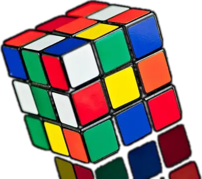

  
# Rubik

# 

    Rubik is a program that simulates and solves a Rubik’s Cube using predefined moves and algorithms. 
    The goal is to efficiently transform any valid scrambled cube into a solved state.

What this project focuses on:

- Logical decomposition of a complex problem
- Efficient state representation
- Algorithmic thinking & optimization

# 
